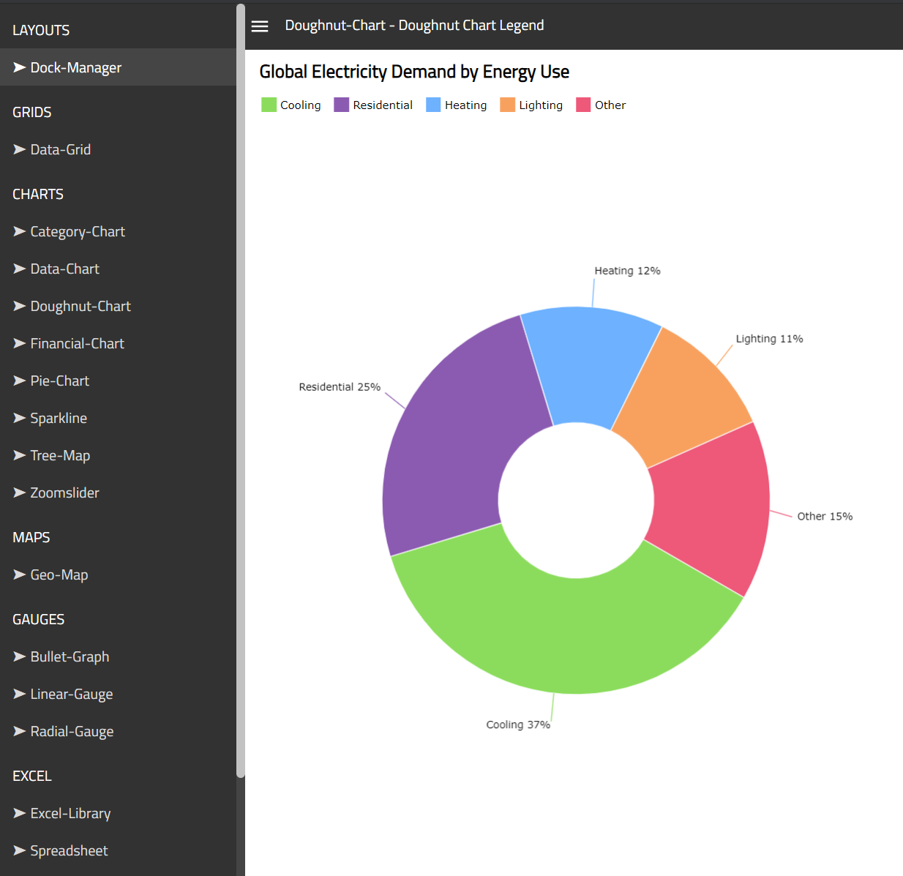

    

# Browser App for React Components

This folder contains source code for a React app that combines examples implemented in the `samples` folder and it allows you to browser [Ignite UI for React](https://www.infragistics.com/products/ignite-ui-react/react/components/general-getting-started.html) components in a single website such as:

- Charts:
[Area](https://www.infragistics.com/products/ignite-ui-react/react/components/charts/types/area-chart),
[Bar](https://www.infragistics.com/products/ignite-ui-react/react/components/charts/types/bar-chart),
[Column](https://www.infragistics.com/products/ignite-ui-react/react/components/charts/types/column-chart),
[Composite](https://www.infragistics.com/products/ignite-ui-react/react/components/charts/types/composite-chart),
[Donut](https://www.infragistics.com/products/ignite-ui-react/react/components/charts/types/donut-chart),
[Financial/Stock](https://www.infragistics.com/products/ignite-ui-react/react/components/charts/types/stock-chart),
[Line](https://www.infragistics.com/products/ignite-ui-react/react/components/charts/types/line-chart),
[Pie](https://www.infragistics.com/products/ignite-ui-react/react/components/charts/types/pie-chart),
[Polar](https://www.infragistics.com/products/ignite-ui-react/react/components/charts/types/polar-chart),
[Radial](https://www.infragistics.com/products/ignite-ui-react/react/components/charts/types/radial-chart),
[Scatter](https://www.infragistics.com/products/ignite-ui-react/react/components/charts/types/scatter-chart),
[Shape](https://www.infragistics.com/products/ignite-ui-react/react/components/charts/types/shape-chart),
[Sparkline](https://www.infragistics.com/products/ignite-ui-react/react/components/charts/types/sparkline-chart),
[Stacked](https://www.infragistics.com/products/ignite-ui-react/react/components/charts/types/stacked-chart),
[Step](https://www.infragistics.com/products/ignite-ui-react/react/components/charts/types/step-chart),
- Maps:
[Geographic Map](https://www.infragistics.com/products/ignite-ui-react/react/components/geo-map.html),
[Treemap](https://www.infragistics.com/products/ignite-ui-react/react/components/treemap-overview.html),
- Gauges:
[Bullet Graph](https://www.infragistics.com/products/ignite-ui-react/react/components/bullet-graph),
[Linear Gauge](https://www.infragistics.com/products/ignite-ui-react/react/components/linear-gauge.html),
[Radial Gauges](https://www.infragistics.com/products/ignite-ui-react/react/components/radial-gauge.html)
- Grids:
[Table / Grid](https://www.infragistics.com/products/ignite-ui-react/react/components/data-grid.html),
[Excel Library](https://www.infragistics.com/products/ignite-ui-react/react/components/excel_library_using_workbooks.html)
- Other:
[Dock Manager](https://www.infragistics.com/products/ignite-ui-react/react/components/dock-manager),
[Date Picker](https://www.infragistics.com/products/ignite-ui-react/react/components/editors/date-picker),
[Multi-Column Combobox](https://www.infragistics.com/products/ignite-ui-react/react/components/editors/multi-column-combobox)

## Branches

> **_NOTE:_** You should use [master](https://github.com/IgniteUI/igniteui-react-examples/tree/master) branch of this repository if you want to run samples on your computer. Use the [vnext](https://github.com/IgniteUI/igniteui-react-examples/tree/vnext) branch only when you want to contribute new samples to this repository.

## Instructions

Follow these instructions to run and browse all samples:

- in VS Code, open the browser folder
`C:\GitHub\igniteui-react-examples\browser`

- select **View** - **Terminal** menu item

- type `npm install` command in terminal window

This will install required packages and [Ignite UI for React](https://infragistics.com/reactsite/components/general-getting-started.html) packages

- type `npm run start` command in terminal window to start this application locally

Note this application copies all individually sample projects from [./samples](./samples) to [./browser/src](./browser/src) folder when it is about to start running. Therefore, any changes to [./browser/src](./browser/src) will be overridden on consecutive run of the application.

Wait until the build is completed and then open [http://localhost:4200](http://localhost:4200) in your browser. You should see a website with navigation menu for browning all samples in this repository.

## Learn More

To learn more about **Ignite UI for React** components, check out the [React documentation](https://www.infragistics.com/products/ignite-ui-react/react/components/general-getting-started.html).
